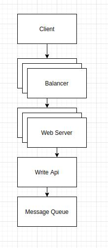
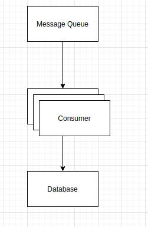

Задача "Есть веб-api, принимающее события для группы аккаунтов (для теста - 1000, в реальности сотни тысяч). События в большом объёме непрерывно (для теста ограничим поток в 10к событий).
        Обработка события занимает 1с. Реализовать фоновую обработку (sleep + лог "результатов") событий с сохранением очерёдности для каждого аккаунта.
        веб-апи эмулировать консольным скриптом, генерирующим события для обработки в фоне.
        События генерировать случайными блоками, содержащими последовательноси по 1-5 для каждого аккаунта."
        
Был реализован класс генератор, создающий случайный набор событий для разных пользователей. Согласно задаче у каждого 
пользователя имеется последовательность событий от 1 до 5. 
Так же файл контроллер, который выполняет роль некой API, принимающей данные от внешнего генератора. 

При запуске скрипта генерируют события для 10к пользователей. Батчи создаются до 1к пользовательских событий
 и записываются в файл (т.к. мы не используем ничего кроме пхп). Имя файла передаётся фоновому процессу через bash скрипт. 
 Баш скрипт добавлен для возможной масштабируемости запуска, чтобы не писать всё в (exec)
 
 Фоновые процессы заберают данные из файлов, удаляют их для освобождения места, передают данные котроллеру апи, 
 задача которого что то сделать с данными, и отдать их в абстрактную очередь. Вместо очереди я использовал файл queue.txt.
 Чтобы не терять порядок событий пользователей, который важен для нас, мы пишем в специальном формате
  USER_ID|STEP|EVENT_NAME. 
  
  Далее с этим файлом можно работать как с очередью, добавить к ними сервис консьюмер, который будет писать эти данные 
  в хранилище.
  
   Изначально архитектура задумывалась в из связки балансеров и веб серверов,
  задача API поднятого на вебсервере - обработать запрос, выполнить необходимую бизнес логику и поместить полученные данные 
  во внешнюю очередь, будь то RabbitMQ или что либо другое. На это задача АПИ заканчивается. 
  
  Для дальнейшей обработки данных нам необходимы сервисы подписчики / consumers
  
    
  
  Раз мы имеем мощный сервис очередей, мы можем поднимать сервисы consumer, задача которых получить данные из очереди,
  выполнить бизнес логику и поместить их в наше основное хралище, допустим OLAP DB.
  
  Такая архитектура позволяет масштабировать её горизонтально, заменять реализации на любые другие, т.к. всё построено 
  на абстракциях. 